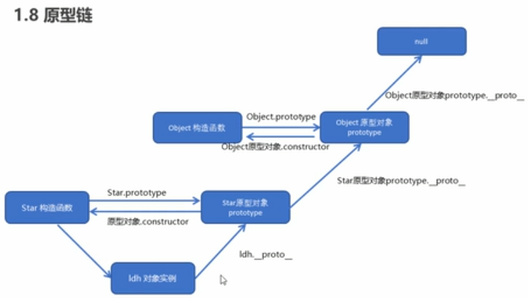

# JavaScript

## 闭包

- 概念：闭包指有权访问另一个函数作用域中变量的函数。
  1. 闭包是一个函数。
  2. 当一个函数访问（引用）另一个函数作用域中的变量时，那该函数就是闭包函数。
  3. eg:函数fn内的fun函数访问fn中的变量时，fun就形成了闭包数数。
- 作用：延伸变量的作用范围。

## 原型(prototype)

- 作用：用于共享方法。
- 每一个构造函数都有一个prototype属性，prototype属性内又有一个constructor属性指回该构造函数。
- constructor用于记录该对象引用于哪个构造函数。
- 每个构造函数的实例对象都有一个__proto__属性，指向其构造函数的prototype属性。

## call、apply、bind

- 相同点：都可以改变函数内部的this指向
- 不同点：
  - call和apply会调用函数，但传参不同。call传参参数arg1,arg2,...形式，apply必须以数组形式[args]传参
  - bind不会调用
- 常用应用场景：
  - call：在子函数继承父函数属性时。eg:function Son(){ Father().call(this,name,age)}
  - apply：跟数组有关的场景，如借助数组对象求最大值、最小值。eg:Math.max.apply(Math,[1,3,4])
  - bind：只想改变函数中this指向而不调用函数时。eg:setTimeout(function(){},100).bind(obj)

## 键盘事件

- onkeydown和onkeyup不区分字母大小写，onkeypress区分字母大小写。
- onkeydown和onkeyup能识别所有的键（包括功能键），onkeypress不能识别功能键。
