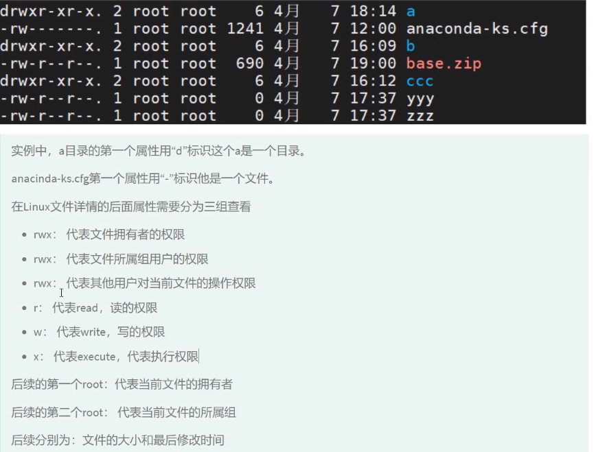

# centos

## Linux常用目录

- /usr：软件安装默认目录，类似于windows中的Program Files目录；
- /bin：存放常使用的可执行文件（binary）；
- /etc：存放系统或者程序的配置文件，类似于windows中的注册表功能；
- /opt：附加程序的安装位置；相当于用户新建目录以存放安装程序；
- /boot：系统启动文件；
- /root：root用户的家目录；
- /home：非root用户的家目录；

## 命令

> - Linux中命令的基本格式：命令 【选项】 【参数】
> - Linux中隐藏文件以.开头；当前目录使用.表示，上一级目录使用..表示

### 常用命令

- `reboot`：重启
- `pwd` : 查看当前路径
- `ip a` ：查看ip地址
- `yum [-y] install 文件路径或文件名` ：安装应用程序
- `clear`：清屏
- `ping`
- `uname -a` ：显示系统全部信息


### 目录相关命令

#### 列出目录

命令：`ls [-ald] [目录名]`

- 目录名可不写，默认为当前目录；
- -a：列出所有文件，包含隐藏文件；
- -l：列举出全部信息；
- -d：仅查看目录本身；

#### 切换目录

命令：`cd 具体路径或符号`

- `~` ：表示当前登录用户的home目录；
- `-` ：表示返回上次所在目录；

#### 创建目录

命令：`mkdir -p 目录名`

- -p ：表示递归创建目录，默认不允许递归创建；

#### 删除目录

命令：`rm -rf 目录名`

- -r： 递归删除目录下的全部内容；
- -f： 强制，不询问，直接删除；

#### 复制目录

命令：`cp -r 源目录 目标目录`

#### 移动或重命名

命令：`mv 源目录 新目录或路径`

### 文件相关命令

#### 创建文件

命令：`touch 文件名`

#### 编辑文件

命令：`vi [文件名]`

- 默认进入的是【查看模式】
  - `/具体内容`：搜索内容，继续按n表示搜索下一处；
  - 连续按两次大写Z可保存文件并退出
- 在【查看模式】按  i、a 、o 进入【编辑模式】
  - i：在当前光标处进入；
  - a：在当前光标后一格进入；
  - o：在当前光标下一行进入；
  - 按 esc 回退到【查看模式】；
- 在【编辑模式】模式按 :  进入【命令模式】
  - `wq` | `x`：保存并退出；
  - `q!`：不保存退出；
  - `set nu` ：显示行号；
  - `set nonu`：隐藏行号；
  - `to [行号]`：跳转至指定行；

#### 查看文件

命令：`cat | tac | nl | more | less | head | tail 文件名`

- cat：从第一开始展示全部内容；tac：则是从最后一行开始倒序展示；
- nl：展示内容的同时显示行号；
- more：查看大文件时，可以一页一页向下翻（按空格翻页，按q退出）；
- less：查看大文件时，则可任意向下或向下翻（按PageUP和PageDown按页翻，按上下键按行查看）；
- head：只查看前几行；tail：只查看最后几行；

- 删除文件
  - `rm -f 文件名`


### 压缩包相关操作

> Linux中常用压缩包：.tar，.tar.gz，.tgz；但也支持.zip和.rar的压缩包。

#### tar 命令

- 解压压缩包：`tar -zxvf 压缩包名称 [-C 路径]`
  - -z：表示压缩包后缀为.gz或.tgz的；
  - -x：表示解压；
  - -v：解压时，打印详细信息；
  - -f：必须在所有参数的最后，表示指定压缩包名称；
  - -C：表示将压缩包解压到指定路径；
- 打包压缩包：`tar -zcvf 压缩包名称 文件1 文件2 目录1 目录2 ...`
  - -c ：表示打包;

#### zip压缩包

> linux 默认不支持zip压缩包格式，所以需要安装zip和unzip(`yum -y install zip unzip`)

- 解压压缩包：`unzip 压缩包名称`
- 打包压缩包：`zip 压缩包名称 文件1 文件2 目录1 目录2...`

### 用户&用户组的操作

#### 用户相关操作

- 创建用户：`useradd [-cgd] [相应参数对应的具体内容] 用户名`

- 设置密码：`passwd 用户名`

  

- 切换用户：`su 用户名`

  - `[root@localhost ~]#|$`：@前为当前登录的用户名，~：表示当前所在位置；#：表示超级管理员；$：表示普通用户

- 删除用户：`userdel [-r] 用户名`

  - -r：表示删除用户的同时，删除该用户的home目录

- 修改用户：`usermod [-cgd] [相应参数对应的具体内容] 用户名`

  - -c：comment，表示给用户添加 一段注释；
  - -g：group，表示修改用户所在的组；
  - -d：表示指定用户的home目录；

#### 用户组相关操作

- 创建用户组：`groupadd 用户组名`
- 修改用户组：`groupmod [-n] [相应参数对应的具体内容] 用户组名`
  - -n：修改用户组名称
- 删除用户组：`groupdel 用户组名`


### 文件权限

> 在linux中通过`ls -l`或`ll` 查看文件和目录的详细信息



#### 修改文件权限

> 使用 chmod 对文件的权限进行修改时，可以使用数字或符号

- 数字方式：`chmod [-R] 777 文件|目录`
  - rwx这三个权限中，它们对应的数值为 r：4，w：2，x：1；
  - -R：递归修改目录下全部内容的权限；
- 符号方式：`chmod [-R] 相应符号 文件|目录`
  - user（文件拥有者)：u，group(文件所属组)：g，other(其它用户)：o，all(全部)：a
  - 赋予权限的方式：添加：+，减掉：-，设定：=

#### 修改文件的拥有者和所属组

- 修改文件的拥有者和所属组：`chown [-R] 拥有者:所属组 文件|目录`
- 修改文件的拥有者：`chown [-R] 拥有者 文件|目录`
- 修改文件的所属组：`chgrp [-R] 所属组 文件|目录`

### 防火墙与端口相关命令

- 查看监听端口： `netstat -lnt`
- 查看防火墙状态： `systemctl status firewalld`
- 禁用防火墙： `systemctl stop firewalld`
- 查看所有打开的端口：`firewall-cmd --list-ports`
- 永久开启 8080 端口： `firewall-cmd --zone=public --permanent --add-port=8080/tcp`
- 重启防火墙：`systemctl restart firewalld.service`

### SELinux 相关命令

- 查看状态：/usr/sbin/sestatus -v
- 永久关闭
  1. vi /etc/selinux/config
  2. 将 SELINUX=enforcing 改为 SELINUX=disabled
  3. reboot(重启)

### 其它命令

- 进程的操作：
  - 查看全部进程：`ps -ef`
  - 查看特定的进程：`ps -ef | grep 搜索的内容`
  - 杀死进程：`kill -9 pid`
- 服务的操作：
  - `systemctl start | stop | restart | enabel | disable | status 服务名称`
- 访问地址：`curl 访问地址`
- 查找文件：`find 路径 -type f | grep profile`

## 其它设置

### CentOS 7 设置以 root 身份自动登录 gnome 桌面

1. vi /etc/gdm/custom.conf
2. 在[daemon]下面添加：

   ```sh
   [daemon]
   AutomaticLoginEnable=True
   AutomaticLogin=root #你想自动登录的用户名
   ```

### 用 yum 安装包提示：No package …… available 时，解决方法

1. 安装 epel-release：`sudo yum -y install epel-release`
2. 更新 yum 以及其它软件包：`sudo yum -y update`


[参考资料]([https://www.bilibili.com/video/BV18D4y1Q7Jv?p=1)

